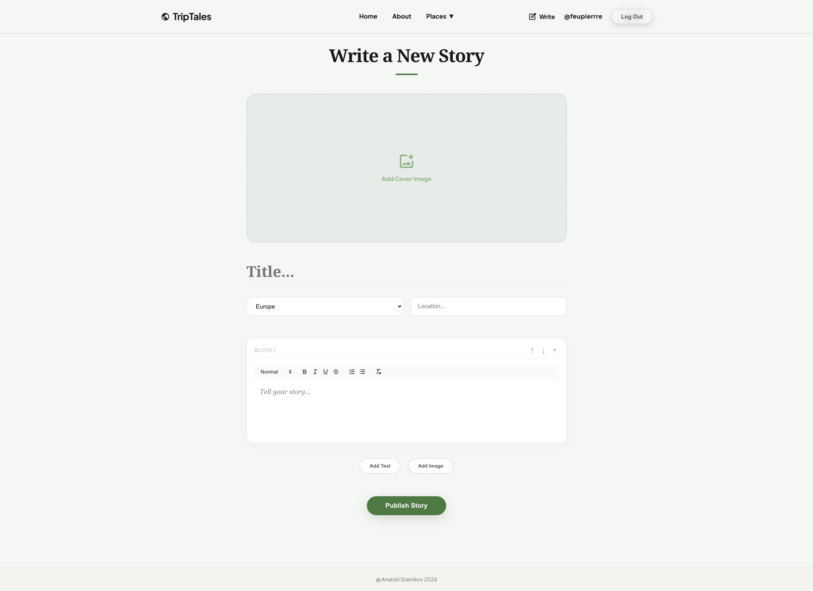

# 🌍 TripTales

### Backend


### Frontend


### Deploy & Infrastructure


---

**TripTales** is an interactive web platform for travelers to share their adventures, visualize routes on a map, and maintain a personal travel blog. The project is built on a modern microservices architecture, fully demo-ready, and containerized with Docker.

---

## 📸 Demonstration

| **Main Page** | **About Page** |
|:---:|:---:|
|  |  |
| **Places Page** | **Profile Page** |
|  |  |
| **Post creation editor** | **Post Page** |
|  |  |
| **Login Page** | **Sign up Page** |
|  |  |

---

## 🚀 Features

### 🔹 Core Functionality
* **Interactive Map:** Visualize travel waypoints using Leaflet.
* **Blogging:** Create posts with photos, location descriptions, and geo-tags.
* **JWT Authentication:** Secure registration and login system (Access & Refresh tokens).
* **Content Management:** Full CRUD operations for stories and user profile management.

### 🔹 Technical Highlights
* **Production-ready Docker:** Complete service isolation (Nginx, Gunicorn, PostgreSQL).
* **Reverse Proxy:** Nginx serves as the single entry point (port 80), handling static files and proxying API requests.
* **Security:** Environment variables via `.env`, CORS protection, and a professional Gunicorn WSGI server.
* **Optimization:** Multi-stage build for the frontend to ensure lightweight production images.

---

## 🛠 Tech Stack
* **Backend:** Python 3.12, Django 6.0, Django Ninja (API), Gunicorn.
* **Database:** PostgreSQL 15.
* **Frontend:** React, Vite, Axios, Leaflet.
* **DevOps:** Docker, Docker Compose, Nginx, Makefile.

---

## ⚙️ Installation & Setup

The project is fully containerized. You don't need to install Python or Node.js locally—just Docker.

### 🚀 Quick Start Guide

1.  **Clone the repository:**
    ```bash
    git clone [https://github.com/Feupierrre/TripTales.git](https://github.com/Feupierrre/TripTales.git)
    cd TripTales
    ```

2.  **Configure Environment:**
    Create a `.env` file in the project root based on the template:
    ```bash
    cp .env.example .env
    ```
    *(Fill in the `SECRET_KEY` and passwords in the created file)*

3.  **Build and Run:**
    ```bash
    make build
    ```

4.  **Create Superuser:**
    ```bash
    make superuser
    ```

The website will be available at: **http://localhost**

---

## 🔧 Management Commands (Makefile)

* `make build` — Full build and start of the project (recommended for the first run).
* `make up` — Fast start of existing containers without rebuilding.
* `make down` — Stop and remove all containers.
* `make logs` — View real-time logs from all services.
* `make superuser` — Create an admin user inside the backend container.

---

## 🔑 Configuration (.env)

Key variables required for the application to function:

```ini
SECRET_KEY=your_secret_key
DEBUG=False
ALLOWED_HOSTS=127.0.0.1,localhost

DB_NAME=travel_db
DB_USER=travel_user
DB_PASSWORD=your_password
DB_HOST=localhost
DB_PORT=5432